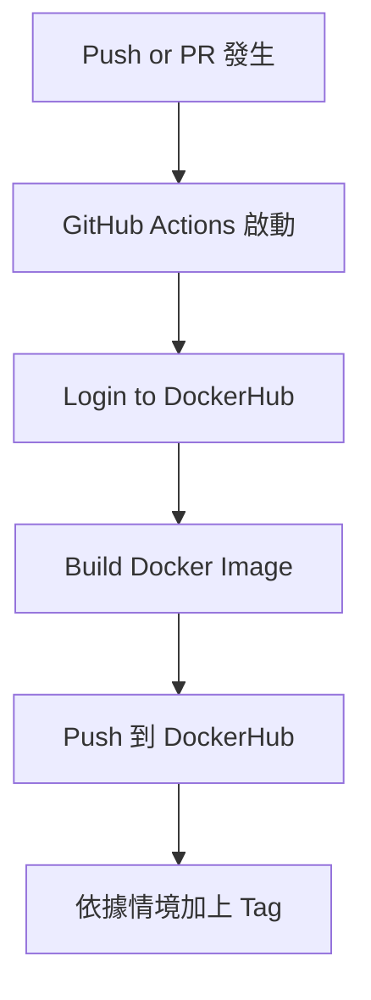

# Docker Homework - 2025cloud

This project demonstrates how to build and run Docker images for NTU 2025 homework.

---

## Build Image

```bash
docker build -t p427/2025cloud:flask .
```

---

## Run Container

```bash
docker run -p 5000:5000 p427/2025cloud:flask
```

---

## Image Variants

This project includes two Docker images:

- **p427/2025cloud:basic**  

- **p427/2025cloud:flask**  

---

## 自動化產生 Container Image 的邏輯說明

本專案使用 GitHub Actions 自動建置與推送 Docker Image 到 [Docker Hub](https://hub.docker.com/repository/docker/p427/2025cloud)，透過 push 與 Pull Request 的方式來觸發自動化流程，並依照用途產生不同 Tag 的 Image。

---

### 自動觸發條件

| 觸發行為             | 是否產生 Image | 說明 |
|----------------------|----------------|------|
| push 到 main         | 是           | 對正式專案內容做修改時，自動 build 並 push 到 Docker Hub，標記為 flask/basic。 |
| GitHub Action 測試 | 是           | 自動執行 docker build，並產生 tag 為 `from-action` 的 image。 |
| 故意寫壞 Dockerfile 開 PR | 不會成功   | 建置階段會失敗，GitHub Action 自動偵測錯誤。 |

---

### 自動建置流程示意圖




---

## Tag 的設計邏輯

| Image Tag        | 說明 |
|------------------|------|
| `basic`          | 最簡單的 Image，只印出一行文字「Hello from Docker!」。 |
| `flask`          | 有安裝 Flask 套件，啟動 Web Server，網址為 http://localhost:5000。 |
| `from-action`    | 由 GitHub Action 自動建置的 Image，代表整合成功。用於驗證 CI/CD 是否能正確運作。 |

---

## 故意讓 CI/CD 失敗的設計

(1) 加了：RUN exit 1
這行會讓 docker build 在執行這一步時立即中止，並回傳錯誤碼 1。
(2) 修改 Dockerfile 最後一行，將原本的 CMD ["python", "app.py"]
改成錯誤的指令 CMD ["pythoooon", "app.py"]，導致找不到執行檔，使得 GitHub Action 失敗。


Pull Request 連結：  
[https://github.com/p42777/docker-homework/pull/3](https://github.com/p42777/docker-homework/pull/3)

---

## 總結

這份專案透過 GitHub Actions，實現了完整的 CI/CD 流程：

- 自動建置與推送 Docker Image 到 DockerHub
- 合理設計不同的 Image Tag 以表示用途
- 能偵測錯誤並終止錯誤的 PR
- README 有清楚描述整體自動化邏輯與流程


